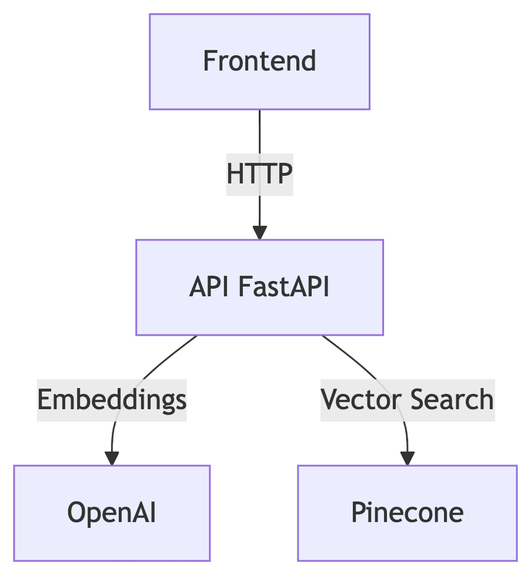

# 📧 Johnson email client - Documentación

Un asistente de correo electrónico inteligente que clasifica mensajes y sugiere respuestas usando IA.  
Se llama Johnson como uno de los agentes de Matrix.

## 🚀 Características principales

- **Clasificación automática** de correos electrónicos
- **Generación de respuestas** contextuales
- **Búsqueda semántica** en historial de correos
- Interfaz web intuitiva
- API RESTful para integraciones

## 🛠 Requisitos técnicos
- Docker 20.10+
- Docker Compose 1.29+
- Cuentas de servicio para:
  - Pinecone (vector database)
  - OpenAI (embeddings)

## 🏗 Estructura del proyecto
```
johnson_email_client/  
├── api/ # Servicio FastAPI  
│ ├── main.py # Lógica principal  
│ ├── Dockerfile # Configuración Docker  
│ └── requirements.txt # Dependencias Python  
│  
├── frontend/ # Interfaz web  
│ ├── static/ # Archivos estáticos  
│ └── Dockerfile # Configuración Docker  
│  
├── docker-compose.yml # Orquestación  
└── .env.example # Variables de entorno  
```

## 🚀 Instalación

1. Clona el repositorio:
   ```bash
   git clone https://github.com/tu-usuario/oak-email-assistant.git
   cd oak-email-assistant
   ```

2. Configura las variables de entorno:
    ```bash
    cp .env.example .env
    nano .env
    ```

    Edita los valores:
    ```env
    PINECONE_API_KEY=tu_clave_pinecone
    OPENAI_API_KEY=tu_clave_openai
    PINECONE_INDEX_NAME=banquetes-emails
    ```

3. Inicia los servicios:
    ```bash
    docker-compose up -d --build
    ```

🌐 Acceso  
Frontend: http://localhost:8080  
API Docs: http://localhost:8000/docs  

🔌 Endpoints de la API  
POST /process-email  
Procesa un correo electrónico y devuelve clasificación y respuesta sugerida.  

Request:

```json
{
  "sender": "cliente@empresa.com",
  "subject": "Consulta importante",
  "content": "Texto del correo..."
}
```

Response:

```json
{
  "classification": {
    "main_category": "Consulta",
    "confidence": 0.92,
    "is_confident": true,
    "all_categories": {"Consulta": 0.92, "Soporte": 0.08}
  },
  "response": {
    "suggested": "Respuesta generada...",
    "based_on_n_examples": 5,
    "average_similarity": 0.87
  }
}
```

🛠 Desarrollo
Reconstruir servicios:
```bash
docker-compose up -d --build
```
Ver logs:
```bash
docker-compose logs -f
```
Detener servicios:
```bash
docker-compose down
```

📊 Arquitectura



🤝 Contribución  
Haz fork del proyecto  

Crea tu rama (git checkout -b feature/nueva-funcionalidad)  

Haz commit de tus cambios (git commit -am 'Add some feature')  

Haz push a la rama (git push origin feature/nueva-funcionalidad)  

Abre un Pull Request